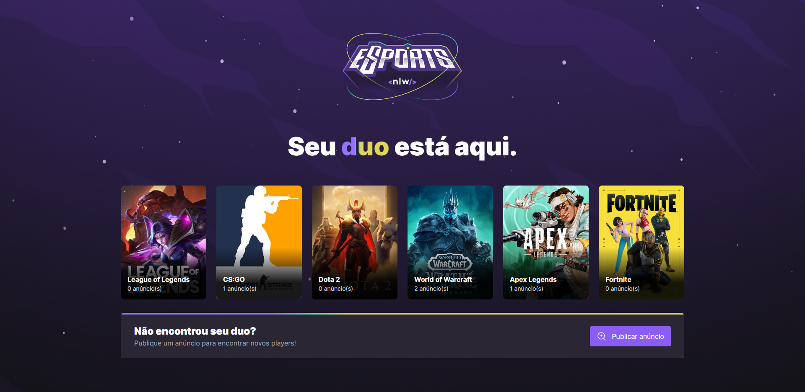
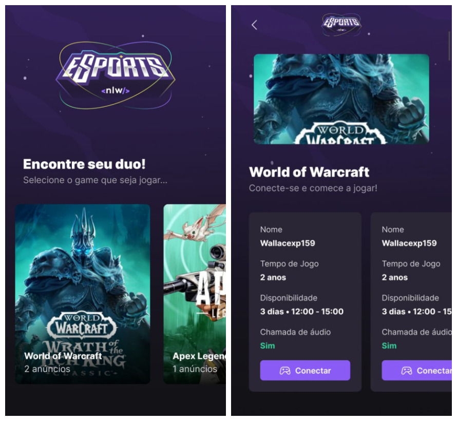

## 💻 Projeto

NLW eSports, aplicativo para encontrar seu duo para os jogos, disponível para versão web e mobile.

*Web*


*Mobile*


## Utilização

### Backend
Navegue até a pasta "server" e utilize o seguinte comando:

```npm run dev``` <br>

Para rodar o backend da aplicação.

### Frontend
Navegue até a pasta "web" e utilize o seguinte comando:

```npm run dev``` <br>

Para rodar o frontend da aplicação.

### Mobile
Navegue até a pasta "mobile" e utilize o seguinte comando:

```expo start``` <br>

Para rodar o frontend da aplicação.

## ✨ Tecnologias

-   [ ] React
-   [ ] Vite
-   [ ] Typesript
-   [ ] Phosphor React
-   [ ] Tailwind CSS
-   [ ] Axios
-   [ ] Express
-   [ ] Cors
-   [ ] Prisma
-   [ ] React Native
-   [ ] React Native Svg
-   [ ] Phosphor React Native
-   [ ] Expo

## 🛠️ Features 
  
-   [ ] Criação de anúncio
-   [ ] Navegação entre jogos e anúncios
-   [ ] Vizualização dos anúncios


## 🔖 Layout

Você pode visualizar o layout do projeto através [desse link](https://www.figma.com/community/file/1150897317533332617). É necessário ter conta no [Figma](http://figma.com/) para acessá-lo.


## 📄 Licença

Esse projeto está sob a licença MIT. Veja o arquivo [LICENSE](https://github.com/WallaceMartinsTI/nlw-esports/blob/main/licence) para mais detalhes.

<br />